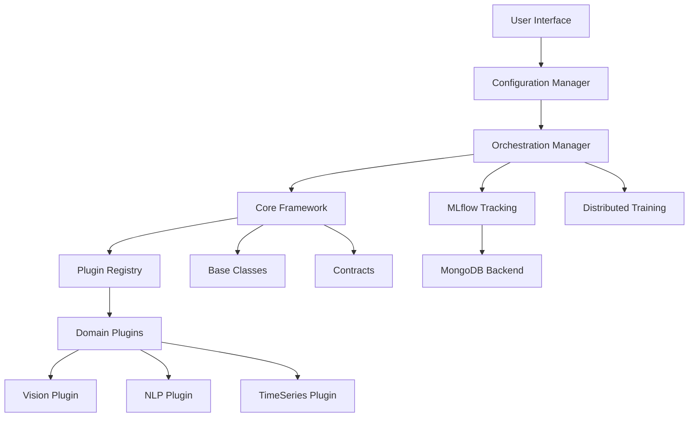

# PyTorch Lightning AI Training Framework Architecture

## System Overview

This document describes the architecture of a plugin-based, extensible AI training framework built on PyTorch Lightning, designed for multi-domain support with comprehensive MLOps integration.

## Architecture Layers

```
┌─────────────────────────────────────────────────────────────┐
│                      User Interface Layer                    │
│         (CLI, API, Jupyter Notebooks, Web Dashboard)        │
└─────────────────────────────────────────────────────────────┘
                               │
┌─────────────────────────────────────────────────────────────┐
│                    Configuration Layer                       │
│              (Hydra Configuration Management)                │
└─────────────────────────────────────────────────────────────┘
                               │
┌─────────────────────────────────────────────────────────────┐
│                     Orchestration Layer                      │
│            (Training Manager, Experiment Runner)             │
└─────────────────────────────────────────────────────────────┘
                               │
┌─────────────────────────────────────────────────────────────┐
│                       Core Framework                         │
│  ┌──────────────┐  ┌──────────────┐  ┌──────────────┐     │
│  │Plugin Registry│  │Base Classes  │  │   Contracts  │     │
│  └──────────────┘  └──────────────┘  └──────────────┘     │
└─────────────────────────────────────────────────────────────┘
                               │
┌─────────────────────────────────────────────────────────────┐
│                      Domain Plugins                          │
│  ┌──────────┐  ┌──────────┐  ┌──────────┐  ┌──────────┐  │
│  │  Vision  │  │   NLP    │  │Time Series│  │  Audio   │  │
│  └──────────┘  └──────────┘  └──────────┘  └──────────┘  │
└─────────────────────────────────────────────────────────────┘
                               │
┌─────────────────────────────────────────────────────────────┐
│                    Infrastructure Layer                      │
│  ┌──────────┐  ┌──────────┐  ┌──────────┐  ┌──────────┐  │
│  │ MLflow   │  │ MongoDB  │  │Distributed│  │  Storage │  │
│  │ Tracking │  │ Backend  │  │  Training │  │  Systems │  │
│  └──────────┘  └──────────┘  └──────────┘  └──────────┘  │
└─────────────────────────────────────────────────────────────┘
```

## Component Architecture

### 1. Core Framework Components

```
core/
├── base/
│   ├── model.py         # BaseModel abstract class
│   ├── dataset.py       # BaseDataModule abstract class
│   ├── trainer.py       # Enhanced trainer with hooks
│   ├── callback.py      # Base callback interfaces
│   └── metric.py        # Metric computation base
├── registry/
│   ├── plugin_registry.py    # Plugin discovery & registration
│   ├── model_registry.py     # Model catalog
│   └── dataset_registry.py   # Dataset catalog
├── contracts/
│   ├── interfaces.py    # Protocol definitions
│   ├── validators.py    # Contract validation
│   └── types.py         # Type definitions
└── utils/
    ├── logging.py       # Centralized logging
    ├── monitoring.py    # System monitoring
    └── distributed.py   # Distributed utilities
```

### 2. Plugin System Architecture

```
plugins/
├── vision/
│   ├── models/
│   │   ├── classification/
│   │   ├── detection/
│   │   └── segmentation/
│   ├── datasets/
│   └── transforms/
├── nlp/
│   ├── models/
│   │   ├── transformers/
│   │   └── sequence/
│   ├── datasets/
│   └── tokenizers/
└── timeseries/
    ├── models/
    │   ├── forecasting/
    │   └── anomaly/
    ├── datasets/
    └── preprocessors/
```

### 3. MLOps Integration Architecture

```
mlops/
├── tracking/
│   ├── mlflow_tracker.py
│   ├── experiment_manager.py
│   └── artifact_manager.py
├── storage/
│   ├── mongodb_backend.py
│   ├── model_store.py
│   └── dataset_cache.py
├── deployment/
│   ├── model_serving.py
│   ├── api_gateway.py
│   └── monitoring.py
└── pipelines/
    ├── training_pipeline.py
    ├── validation_pipeline.py
    └── deployment_pipeline.py
```

## Design Patterns

### 1. Plugin Architecture Pattern
- **Discovery**: Automatic plugin discovery via entry points
- **Registration**: Dynamic registration at runtime
- **Validation**: Contract-based validation
- **Isolation**: Plugin isolation for stability

### 2. Factory Pattern
- Model factories for different architectures
- Dataset factories for various data sources
- Transform factories for preprocessing

### 3. Strategy Pattern
- Training strategies (DDP, FSDP, DeepSpeed)
- Optimization strategies
- Evaluation strategies

### 4. Observer Pattern
- Callback system for training events
- Metric tracking and logging
- Progress monitoring

## Module Dependencies



## Extensibility Points

1. **Model Extensions**: Inherit from `BaseModel` to add new architectures
2. **Dataset Extensions**: Implement `BaseDataModule` for new data sources
3. **Callback Extensions**: Create custom callbacks for training hooks
4. **Metric Extensions**: Add domain-specific metrics
5. **Transform Extensions**: Implement custom preprocessing
6. **Storage Extensions**: Add new backend storage systems

## Configuration Management

### Hydra Integration
```yaml
# config/config.yaml
defaults:
  - model: resnet50
  - dataset: imagenet
  - trainer: ddp
  - callbacks: default
  - _self_

experiment:
  name: ${model.name}_${dataset.name}
  seed: 42

mlflow:
  tracking_uri: mongodb://localhost:27017
  experiment_name: ${experiment.name}
```

## Quality Attributes

### Scalability
- Horizontal scaling via distributed training
- Plugin-based vertical scaling
- Lazy loading of components

### Maintainability
- Clear separation of concerns
- Comprehensive type hints
- Contract-based development

### Performance
- Optimized data pipelines
- Caching strategies
- Distributed computing support

### Reliability
- Graceful degradation
- Error recovery mechanisms
- Comprehensive testing

## Security Considerations

1. **Data Security**: Encryption at rest and in transit
2. **Model Security**: Model versioning and access control
3. **API Security**: Authentication and authorization
4. **Audit Logging**: Comprehensive activity logging