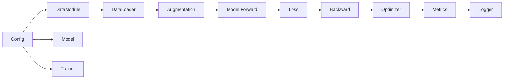
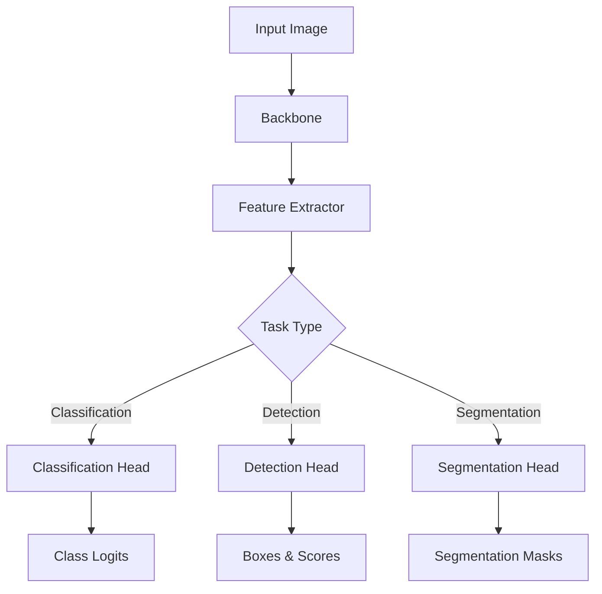

# Vision PyTorch Lightning Framework Architecture

## Overview

This document describes the architecture of the Vision-focused PyTorch Lightning framework designed for the BDD MLOps project. The framework provides a modular, extensible, and production-ready system for training vision models with comprehensive experiment tracking and configuration management.

## Architecture Principles

### 1. Separation of Concerns
- **Model Logic**: Isolated in `BaseVisionModel` and specific implementations
- **Data Pipeline**: Handled by `BaseVisionDataModule` and dataset-specific modules
- **Training Orchestration**: Managed by PyTorch Lightning Trainer
- **Configuration**: Centralized through Hydra configuration system
- **Experiment Tracking**: Delegated to MLflow/TensorBoard

### 2. Plugin-Based Extensibility
- **Model Registry**: Dynamic model registration and discovery
- **DataModule Registry**: Automatic dataset registration
- **Transform Registry**: Pluggable augmentation pipeline
- **Callback Registry**: Custom training hooks

### 3. Contract-Driven Design
- **Interfaces**: Clear contracts for models, data, and training components
- **Type Safety**: Comprehensive type hints throughout
- **Validation**: Runtime contract validation

## Component Architecture

### Core Components

```
src/
├── core/
│   ├── base/                    # Base classes
│   │   ├── base_model.py       # Abstract vision model
│   │   ├── base_datamodule.py  # Abstract data module
│   │   ├── base_transform.py   # Transform abstractions
│   │   └── base_callback.py    # Callback abstractions
│   ├── registry/                # Plugin registration
│   │   ├── model_registry.py   # Model registration
│   │   ├── data_registry.py    # Data registration
│   │   └── transform_registry.py
│   ├── contracts/               # Interface definitions
│   │   ├── model_interface.py  # Model contracts
│   │   ├── data_interface.py   # Data contracts
│   │   └── trainer_interface.py
│   └── factory/                 # Factory patterns
│       ├── trainer_factory.py  # Trainer creation
│       └── model_factory.py    # Model instantiation
```

### Vision Components

```
src/
└── vision/
    ├── models/                  # Vision models
    │   ├── classification.py   # Classification models
    │   ├── detection.py        # Object detection
    │   └── segmentation.py     # Segmentation models
    ├── data/                    # Vision datasets
    │   ├── cifar.py           # CIFAR-10/100
    │   ├── imagenet.py        # ImageNet
    │   └── coco.py            # COCO dataset
    └── transforms/              # Vision augmentations
        ├── geometric.py        # Geometric transforms
        ├── color.py           # Color augmentations
        └── advanced.py        # Advanced augmentations
```

## Design Patterns

### 1. Factory Pattern
Used for creating complex objects with configuration:

```python
class TrainerFactory:
    @staticmethod
    def create_trainer(config: DictConfig) -> pl.Trainer:
        callbacks = TrainerFactory.create_callbacks(config)
        logger = TrainerFactory.create_logger(config)
        return pl.Trainer(callbacks=callbacks, logger=logger, **config.trainer)
```

### 2. Registry Pattern
Dynamic registration and discovery of components:

```python
@register_model("resnet", task_type="classification")
class ResNetClassifier(BaseVisionModel):
    ...

# Usage
model = ModelRegistry.create_model("resnet", config)
```

### 3. Template Method Pattern
Base classes define algorithm structure, subclasses implement details:

```python
class BaseVisionModel(pl.LightningModule):
    def training_step(self, batch, batch_idx):
        # Template method
        x, y = batch
        y_hat = self(x)
        loss = self.criterion(y_hat, y)
        self.log("train/loss", loss)
        return loss

    @abstractmethod
    def _build_backbone(self):
        # Subclasses implement
        pass
```

### 4. Strategy Pattern
Interchangeable algorithms for transforms and augmentations:

```python
class MixupTransform:
    def __call__(self, images, targets):
        # Mixup strategy
        ...

class CutMixTransform:
    def __call__(self, images, targets):
        # CutMix strategy
        ...
```

## Data Flow

### Training Pipeline



### Model Architecture



## Configuration System

### Hydra Configuration Hierarchy

```yaml
configs/
├── config.yaml              # Main config
├── model/
│   ├── resnet.yaml         # ResNet config
│   └── efficientnet.yaml   # EfficientNet config
├── data/
│   ├── cifar10.yaml       # CIFAR-10 config
│   └── imagenet.yaml      # ImageNet config
├── trainer/
│   ├── default.yaml       # Default trainer
│   └── multi_gpu.yaml     # Multi-GPU trainer
└── callbacks/
    └── default.yaml       # Callback configs
```

### Configuration Composition

```yaml
# Command line composition
python main.py model=resnet data=cifar10 trainer=multi_gpu

# Config file composition
defaults:
  - model: resnet
  - data: cifar10
  - trainer: default
  - callbacks: default
```

## Extension Points

### Adding New Models

1. Create model class inheriting from `BaseVisionModel`
2. Register with decorator: `@register_model("model_name")`
3. Add configuration file: `configs/model/model_name.yaml`

### Adding New Datasets

1. Create datamodule inheriting from `BaseVisionDataModule`
2. Register with decorator: `@register_datamodule("dataset_name")`
3. Add configuration file: `configs/data/dataset_name.yaml`

### Adding Custom Callbacks

1. Create callback inheriting from `BaseVisionCallback`
2. Register with decorator: `@register_callback("callback_name")`
3. Add to callback configuration

## Performance Optimizations

### Memory Optimization
- Gradient accumulation for large batch sizes
- Mixed precision training (FP16)
- Gradient checkpointing for large models
- Efficient data loading with persistent workers

### Speed Optimization
- Multi-GPU training with DDP
- Compiled models with torch.compile
- Optimized data augmentation pipeline
- Cached dataset loading

### Training Optimization
- Learning rate scheduling
- Stochastic Weight Averaging (SWA)
- Exponential Moving Average (EMA)
- Progressive resizing

## Quality Assurance

### Type Safety
```python
def forward(self, x: torch.Tensor) -> torch.Tensor:
    features: torch.Tensor = self.backbone(x)
    output: torch.Tensor = self.head(features)
    return output
```

### Contract Validation
```python
class ModelContract:
    @staticmethod
    def validate_model(model: nn.Module, task_type: TaskType) -> bool:
        assert hasattr(model, "forward")
        assert hasattr(model, "training_step")
        return True
```

### Testing Strategy
- Unit tests for individual components
- Integration tests for pipelines
- BDD tests for workflows
- Performance benchmarks

## Deployment Considerations

### Model Export
- ONNX export for inference
- TorchScript for production
- Model quantization support
- Pruning and optimization

### Serving Infrastructure
- REST API with FastAPI
- Batch inference support
- Model versioning
- A/B testing capabilities

## Future Enhancements

### Planned Features
1. Vision Transformer (ViT) support
2. Neural Architecture Search (NAS)
3. Self-supervised learning methods
4. Multi-modal vision-language models
5. Federated learning support

### Extensibility Roadmap
1. Graph neural networks for vision
2. 3D vision and point cloud processing
3. Video understanding models
4. Real-time inference optimization
5. AutoML capabilities

## Conclusion

This architecture provides a robust, scalable, and maintainable framework for vision model development. The modular design, clear contracts, and comprehensive configuration system enable rapid experimentation while maintaining production-grade quality.